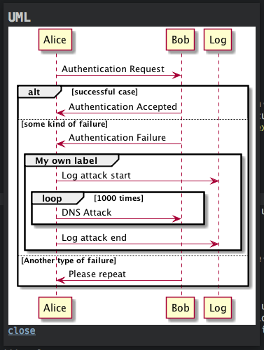

# MdPopups Test Plugin

Run command `Mdpopups: Test` and choose either popup or phantom.  This demonstrates basic formatting.

-- or --

Run command `Mdpopups: Test UML` and choose either popup or phantom.  This demonstrates custom fences using UML. Requires Java and Graphviz to be installed and in your path. See http://plantuml.com/starting.

Edit `test.py` to play around with the commands.

Need Mdpopups 2.1.0+
